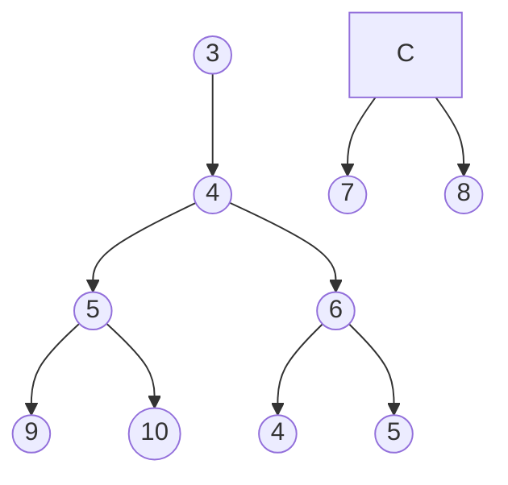

### Universidad Nacional de San Agustín <br/> Maestría en Ciencia de la Computación <br/>  Algoritmos y Estructura de Datos
<hr/>

# Practica 01

| DOCENTE | CARRERA | CURSO |
| :-: | :-: | :-: |
| Vicente Machaca Arceda | Maestría en Ciencia de la Computación | Algoritmos y Estructura de Datos |
<br/>

| PRÁCTICA | TEMA | DURACIÓN |
| :-: | :-: | :-: |
| 02 | Algoritmos de búsqueda | 3 horas


## 1. Alumno
- Paredes Rodriguez, Raybert

## 2. Ejercicios

### 2.1. Árbol - ALV

alv



### 2.2. Árbol B-Tree

b-tree

```mermaid
graph TB
    A((3))-->B((4))
    B-->E((5))
    B-->F((6))
    C-->G((7))
    C-->H((8))
    E-->I((9))
    E-->J((10))    
    F-->D((4))
    F-->K((5))
``` D
```
