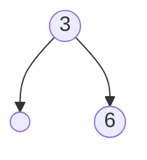
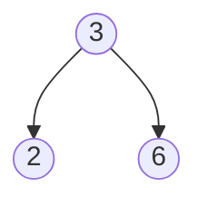
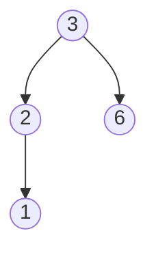
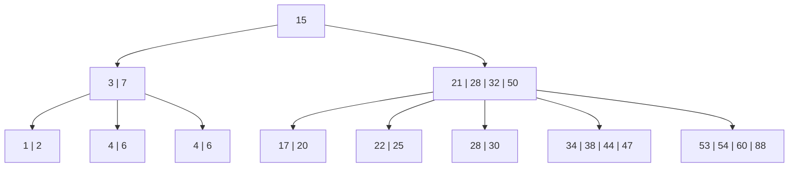

### Universidad Nacional de San Agustín   Maestría en Ciencia de la Computación    Algoritmos y Estructura de Datos

# Practica 02

| DOCENTE | CARRERA | CURSO |
| :-: | :-: | :-: |
| Vicente Machaca Arceda | Maestría en Ciencia de la Computación | Algoritmos y Estructura de Datos |
 

| PRÁCTICA | TEMA | DURACIÓN |
| :-: | :-: | :-: |
| 02 | Algoritmos de búsqueda | 3 horas

## 1. Alumno
- Paredes Rodriguez, Raybert

## 2. Ejercicios

### 2.1. Árbol - ALV

AVL Tree es una estructura de datos de árbol binario autoequilibrado. Tiene tiempos de inserción, eliminación
y búsqueda muy eficientes. En cuanto a la profundidad de un ´arbol AVL en ambos lados, difiere como máximo
en 1 nivel. En cualquier otro momento en el que la diferencia de altura/profundidad sea superior a 1 o inferior
a -1, se produce un reequilibrio. En términos de espacio tiene una complejidad O(n). Con la complejidad del
tiempo, tiene O (log n) para todos los casos (peor, promedio, mejor). Comparando esto con el árbol rojo-negro
comúnmente conocido, el árbol AVL está más rígidamente equilibrado que el árbol RB, por lo tanto, aunque
tiene tiempos de recuperación rápidos, el árbol RB es más eficiente en los tiempos de inserción y eliminación.
No obstante, ambos tienen un tiempo de ejecución de O(log n) y se equilibran automáticamente. El nombre
AVL proviene de los creadores de este algoritmo (Adelson-Velskii y Landis).
Los árboles de búsqueda binarios est´an organizados de la siguiente forma:

    Nodo BST: Clave = k*
    k ≤ k ∗ k∗ ≤ k

Al trabajar con árboles AVL, las operaciones deben preservar dos propiedades:
* **Altura balanceada:** Las alturas de los subárboles izquierdo y derecho están dentro de 1
* **BST:** Los valores en el subárbol izquierdo son más pequeños que el valor raíz, que es más pequeño que
los valores en el subárbol derecho.
Cuando se agrega un nuevo valor en el árbol al que pertenece, se debe comprobar si todos los sub-árboles
todavía están equilibrados en altura. Si no lo estan, debe volver a equilibrar el árbol cambiando su forma (es
decir, moviéndose alrededor de los nodos o incluso subárboles completos).

**Ejemplo**

* **Insertar (3)**

* **Insertar (6)**

* **Insertar (2)**

* **Insertar (1)**

### 2.2. Árbol B-Tree

Un B-Tree es un árbol autoequilibrado que mantiene datos ordenados y permite búsquedas, inserciones y eliminaciones en tiempo logarítmico.\par

Están diseñados para funcionar bien cuando se almacenan en un almacenamiento secundario, como un disco duro. El tamaño de un nodo es normalmente del mismo tamaño que el tamaño del bloque/página del sistema.\par

* **Búsqueda:**  Requiere atravesar cada nivel del árbol hasta encontrar la clave. Es similar al algoritmo de búsqueda binaria, excepto que se usa una búsqueda de rango para identificar al niño correcto para visitar.
            
* **Insertar:** Los valores en el subárbol izquierdo son más pequeños que el valor raíz, que es más pequeño que los valores en el subárbol derecho.
            La inserción implica buscar la nueva posición de la hoja e insertar la nueva clave en orden ordenado. En el caso de que el nodo hoja esté lleno, el nodo debe dividirse.
            Dividir implica crear dos nodos a partir del nodo completo las llaves de s, divididas alrededor de la clave de la mediana para tener llaves cada uno. El nodo mediano se mueve padre de para identificar el punto de división entre los dos nuevos árboles.
            Para evitar la división recursiva de nodos hasta la raíz, puede dividir nodos completos de manera preventiva mientras recorre el árbol.
            
* **Eliminar:** Hay dos estrategias populares de eliminación de árboles B:
            
    1. Localice y elimine el elemento (a la find()), luego reestructure el árbol para conservar sus invariantes.
    2. Realice una sola pasada por el árbol, pero antes de visitar un nodo, reestructure el árbol para que, una vez que se encuentre la clave que se va a eliminar, se pueda eliminar sin desencadenar la necesidad de una reestructuración adicional. Mantener las invariantes del árbol B al eliminar implica mover las claves de los nodos hermanos que tienen

## 2. Repositorio

La implementación de los algoritmos y los datos utilizados es el siguiente:

https://github.com/UNSA-MCC-2022/AyED_Practica_02

## 3. Representación gráfica}

Se realizó la implementación de la representación gráfica de los algoritmos indicados, esto se pueden visualizar en el siguiente enlace:

https://unsa-mcc-2022.github.io/AyED_Practica_02

